# Arsitektur Aplikasi — Sistem Informasi Manajemen Perpustakaan (Laravel + Livewire)

Dokumen ini menjelaskan rancangan arsitektur, pola desain, dan alur eksekusi data yang diterapkan pada Sistem Informasi Manajemen Perpustakaan berbasis Laravel 13 & Livewire 3.

---

## 1. Konsep Utama: Repository Pattern & Action Class

Proyek ini menerapkan perpaduan **Repository Pattern** dan **Action Class** (Clean Architecture versi ringan) untuk memisahkan tanggung jawab kode (Separation of Concerns).

```
[ UI Layer ]               --> Livewire Components (BookIndex, LoanForm, ReturnForm, dll)
                                 │
[ Business Logic Layer ]   --> Action Classes (BorrowBookAction, ReturnBookAction, dll)
                                 │
[ Data Access Layer ]      --> Repository Interfaces & Eloquent Implementations
                                 │
[ Persistence Layer ]      --> Database Models & MySQL Database
```

### Keuntungan Arsitektur Ini:
1. **Livewire Component Tipis & Fokus:** Component hanya mengurusi validasi form sederhana dan rendering UI state.
2. **Reusabilitas Business Logic:** Logika seperti transaksi peminjaman (`BorrowBookAction`) atau pengembalian (`ReturnBookAction`) dapat dipanggil dari mana saja (misal: Livewire, CLI/Artisan Command, REST API) tanpa membuat ulang kodenya.
3. **Mockable & Testable:** Modul database diisolasi di balik *Repository Interfaces* yang di-bind di `RepositoryServiceProvider`, mempermudah pengujian (Unit/Feature Testing).
4. **Data Integrity:** Operasi multi-tabel (misal: update stok buku + simpan log peminjaman) dibungkus secara aman di dalam `DB::transaction()`.

---

## 2. Directory Structure

```text
app/
├── Actions/                  # Tempat seluruh aturan & transaksi bisnis aplikasi
│   ├── Book/
│   │   ├── CreateBookAction.php
│   │   ├── UpdateBookAction.php
│   │   ├── DeleteBookAction.php
│   │   └── SearchBooksAction.php
│   ├── Member/
│   │   ├── CreateMemberAction.php
│   │   ├── UpdateMemberAction.php
│   │   └── DeleteMemberAction.php
│   └── Loan/
│       ├── BorrowBookAction.php
│       ├── ReturnBookAction.php
│       ├── CalculateFineAction.php
│       └── GetOverdueLoansAction.php
│
├── Repositories/             # Data Access Layer
│   ├── Contracts/            # Interface / Abstraksi Repository
│   │   ├── BookRepositoryInterface.php
│   │   ├── CategoryRepositoryInterface.php
│   │   ├── LoanRepositoryInterface.php
│   │   └── MemberRepositoryInterface.php
│   └── Eloquent/             # Implementasi Query Eloquent
│       ├── EloquentBookRepository.php
│       ├── EloquentCategoryRepository.php
│       ├── EloquentLoanRepository.php
│       └── EloquentMemberRepository.php
│
├── Livewire/                 # UI Component Controller (Orchestration & State Only)
│   ├── Dashboard.php
│   ├── SidebarNavigation.php
│   ├── LanguageSwitcher.php
│   ├── Books/
│   ├── Members/
│   └── Loans/
│
└── Providers/
    └── RepositoryServiceProvider.php # IoC Container Dependency Injection Bindings
```

---

## 3. Alur Eksekusi Data (Data Flow Diagram)

Berikut adalah diagram alur ketika seorang pustakawan mencatat peminjaman buku baru melalui sistem:

```mermaid
sequenceDiagram
    autonumber
    actor Librarian as Pustakawan
    participant UI as Livewire LoanForm
    participant Action as BorrowBookAction
    participant BookRepo as EloquentBookRepository
    participant MemberRepo as EloquentMemberRepository
    participant LoanRepo as EloquentLoanRepository
    participant DB as Database (MySQL)

    Librarian->>UI: Submit Form Peminjaman (Member & Book ID)
    UI->>Action: execute(memberId, bookId, customDays)
    Action->>MemberRepo: findById(memberId)
    MemberRepo-->>Action: Member Data (Cek Status Aktif & Limit Pinjam)
    Action->>BookRepo: findById(bookId)
    BookRepo-->>Action: Book Data (Cek Ketersediaan Stok)
    
    rect rgb(20, 30, 40)
        note over Action,DB: DB Transaction Started
        Action->>LoanRepo: createLoan(memberId, bookId, loanDate, dueDate)
        LoanRepo->>DB: INSERT INTO loans
        Action->>BookRepo: decrementStock(bookId)
        BookRepo->>DB: UPDATE books SET available_copies = available_copies - 1
    end
    
    Action-->>UI: Loan Created Successfully
    UI-->>Librarian: Tampilkan Flash Success Message
```



---

## 4. Aturan Bisnis & Konfigurasi (`config/library.php`)

Aturan bisnis perpustakaan disimpan secara dinamis di `config/library.php`:

* **Batas Maksimal Pinjam:** 3 buku per anggota (`max_books_per_member`)
* **Durasi Pinjam Standar:** 7 hari (`default_loan_days`)
* **Tarif Denda Keterlambatan:** Rp 2.000 / hari keterlambatan (`fine_per_day`)

---

## 5. Lokalisasi Dwibahasa (Indonesian & English)

Aplikasi mendukung lokalisasi penuh menggunakan middleware `SetLocale`. User dapat berganti bahasa kapan saja via komponen `LanguageSwitcher` di header atas. File terjemahan dapat ditemukan pada:
* `lang/id/*.php` (Bahasa Indonesia)
* `lang/en/*.php` (English)
