# 📄 DOKUMENTASI SPESIFIKASI & DIAGRAM SISTEM
## Sistem Informasi Manajemen Perpustakaan (LibSys)
**Teknologi:** Laravel 13 | Livewire 3 | Tailwind CSS | MySQL

---

## 1. PENDAHULUAN

Dokumen ini berisi spesifikasi kebutuhan **Fungsional** dan **Non-Fungsional** beserta diagram arsitektur sistem untuk **Sistem Informasi Manajemen Perpustakaan (LibSys)**. Dokumentasi ini disusun berdasarkan implementasi kode nyata pada proyek web ini.

---

## 2. MATRIKS HAK AKSES & OPERASI PENGGUNA (SPESIFIKASI FUNGSIONAL)

Tabel berikut menjelaskan mengenai peran aktor dalam sistem, operasi yang dapat dilakukan (*Bisa Ngapain*), serta alur kerja teknisnya (*Bagaimana Caranya*):

| Peran (Role) | Fitur / Operasi | Bagaimana Caranya? (Mekanisme & Alur Kerja System) | Modul & Rute Web |
| :--- | :--- | :--- | :--- |
| **👑 Administrator** | **Kelola Akun System** | • Membuat akun pengguna baru (`admin` / `librarian`) dengan validasi email unik dan enkripsi password `Bcrypt`. • Mengubah password akun pengguna yang lupa. • Menghapus akun pengguna lain (dilengkapi fitur *self-delete prevention* agar tidak bisa menghapus diri sendiri). | `/users` (`UserManager`) |
| **👑 Administrator** | **Audit Trail & Keamanan** | • Memantau riwayat login seluruh pengelola perpustakaan secara real-time. • Melacak informasi alamat IP, User Agent browser, waktu login, dan status login. | `/login-logs` (`LoginLogIndex`) |
| **👑 Administrator** | **Akses Seluruh Fitur** | • Memiliki wewenang tingkat tinggi untuk menjalankan seluruh transaksi pustakawan. | Seluruh Rute Internal |
| --- | --- | --- | --- |
| **🧑‍💼 Pustakawan / Staff** | **Pencatatan Peminjaman** | • Input Anggota & Buku yang dipinjam. • System otomatis memvalidasi: *Status Anggota Aktif*, *Batas Maksimal 3 Buku*, dan *Stok Buku Available*. • Memotong stok buku & menghitung tanggal jatuh tempo 7 hari secara otomatis. | `/loans/create` (`LoanForm` & `BorrowBookAction`) |
| **🧑‍💼 Pustakawan / Staff** | **Pengembalian & Hitung Denda** | • Memproses pengembalian buku terpinjam. • System otomatis menghitung hari keterlambatan dan kalkulasi denda (Rp 2.000/hari). • Mengembalikan jumlah stok ketersediaan buku ke katalog. | `/loans/return` (`ReturnForm` & `CalculateFineAction`) |
| **🧑‍💼 Pustakawan / Staff** | **Monitoring Overdue** | • Memantau daftar peminjaman yang melewati batas jatuh tempo. • Memberikan peringatan denda dan status pengembalian. | `/loans/overdue` (`OverdueList` & `GetOverdueLoansAction`) |
| **🧑‍💼 Pustakawan / Staff** | **Kelola Katalog & Koleksi** | • Olah data buku (Tambah, Edit, Hapus, Detail) beserta pengkategorian Genre & Kategori. • **Import Massal:** Upload file Excel/CSV untuk menambahkan banyak data buku sekaligus ke database. | `/books`, `/categories`, `/genres`, `/books/import` |
| **🧑‍💼 Pustakawan / Staff** | **Kelola Data Anggota** | • Registrasi anggota baru dan melihat profil riwayat transaksi. • **Promosi Kelas:** Memproses pembaruan tingkat/kelas anggota secara massal. | `/members`, `/members/promote` |
| **🧑‍💼 Pustakawan / Staff** | **Laporan & Analytics** | • Pantau statistik utama pada Dashboard (Total Buku, Total Member, Active Loans, Overdue). • Melihat grafik & laporan statistik buku yang paling sering dipinjam. | `/dashboard`, `/reports/popular` |
| --- | --- | --- | --- |
| **🌐 Pengunjung / Tamu** | **Katalog Publik Web** | • Mengakses halaman utama (Landing Page). • Melakukan pencarian dan filter katalog buku secara transparan tanpa perlu login. | `/`, `/catalog` (`LandingPage` & `GuestCatalog`) |
| **🌐 Pengunjung / Tamu** | **Lokalisasi Multi-Bahasa** | • Mengubah bahasa tampilan aplikasi secara instan melalui header (Bahasa Indonesia, Inggris, Arab, Melayu, Belanda). | `LanguageSwitcher` (`SetLocale` Middleware) |

---

## 3. DIAGRAM SISTEM FUNGSIONAL (FUNCTIONAL SYSTEM DIAGRAM)

Diagram ini menggambarkan pembagian modul fungsional serta alur interaksi setiap peran pengguna (*Guest*, *Staff/Pustakawan*, dan *Administrator*) terhadap fitur-fitur di dalam aplikasi:

```mermaid
graph TD
    subgraph USERS["👥 Pengguna Sistem"]
        Guest["🌐 Pengunjung Publik (Tamu)"]
        Staff["🧑‍💼 Pustakawan / Staff"]
        Admin["👑 Administrator"]
    end

    subgraph SYSTEM_FUNC["⚙️ DIAGRAM SISTEM FUNGSIONAL (LIB SYS)"]

        subgraph MOD_PUBLIC["🌐 Modul Publik (Tanpa Login)"]
            F1["Landing Page & Profil Perpustakaan"]
            F2["Pencarian Katalog Buku Publik"]
            F3["Pengubah Bahasa Interface (ID, EN, AR, MS, NL)"]
        end

        subgraph MOD_CATALOG["📚 Modul Pengelolaan Katalog"]
            F4["CRUD Data Buku & Stok Available"]
            F5["Import Data Buku Massal (Excel/CSV)"]
            F6["Kelola Kategori & Genre Koleksi"]
        end

        subgraph MOD_MEMBER["👥 Modul Pengelolaan Anggota"]
            F7["Registrasi & Riwayat Anggota"]
            F8["Promosi Kenaikan Kelas/Level Anggota"]
        end

        subgraph MOD_CIRCULATION["🔄 Modul Sirkulasi & Transaksi"]
            F9["Form Input Peminjaman Buku"]
            F10["Form Pengembalian & Hitung Denda Otomatis"]
            F11["Monitoring Keterlambatan (Overdue List)"]
        end

        subgraph MOD_REPORT["📈 Modul Dashboard & Analytics"]
            F12["Dashboard Ringkasan Statistik Real-time"]
            F13["Laporan Statistik Buku Populer"]
        end

        subgraph MOD_ADMIN["🔒 Modul Administrator & Audit"]
            F14["Kelola Akun System & Reset Password"]
            F15["Audit Trail Log Login (IP & User Agent)"]
        end

    end

    %% ALUR INTERAKSI FUNGSIONAL
    Guest --> F1
    Guest --> F2
    Guest --> F3

    Staff --> F12
    Staff --> F4
    Staff --> F5
    Staff --> F6
    Staff --> F7
    Staff --> F8
    Staff --> F9
    Staff --> F10
    Staff --> F11
    Staff --> F13

    Admin --> Staff
    Admin --> F14
    Admin --> F15
```

---

## 4. DIAGRAM SISTEM NON-FUNGSIONAL (NON-FUNCTIONAL SYSTEM DIAGRAM)

Diagram ini menjelaskan pilar-pilar kualitas dan arsitektur teknis yang menjamin performa, keandalan, dan keamanan sistem web:

```mermaid
graph TB
    subgraph SYSTEM_NONFUNC["🛡️ DIAGRAM SISTEM NON-FUNGSIONAL (LIB SYS)"]

        subgraph PILAR1["1. KEAMANAN & PRIVASI (Security)"]
            N1["🔐 Middleware Auth Guard ('auth')"]
            N2["👑 Role-Based Access Control (RBAC Admin vs Staff)"]
            N3["🔑 Enkripsi Password Bcrypt & CSRF Protection"]
            N4["📜 Audit Trail Log Activity (Tracking IP & User Agent)"]
        end

        subgraph PILAR2["2. ARSITEKTUR KODE (Maintainability)"]
            N5["🧱 Separation of Concerns (Clean Architecture)"]
            N6["⚡ Reusable Action Classes (BorrowBookAction, CalculateFineAction)"]
            N7["📦 Data Access Layer (Repository Pattern & Contracts)"]
            N8["🖥️ Livewire 3 Component Orchestration"]
        end

        subgraph PILAR3["3. PERFORMA & INTEGRITAS (Performance & Reliability)"]
            N9["🛡️ Database Transaction Safety (DB::transaction)"]
            N10["⚡ Interaktivitas SPA tanpa Reload (Livewire Engine)"]
            N11["📂 Engine Import Data Excel/CSV Teroptimasi"]
            N12["🚀 Indexing Database MySQL & Fast Eloquent Queries"]
        end

        subgraph PILAR4["4. AKSESIBILITAS & USABILITY (Usability & i18n)"]
            N13["📱 Layout Responsif (Tailwind CSS Framework)"]
            N14["🌍 Engine Lokalisasi Bahasa (JSON Translation ID, EN, AR, MS, NL)"]
            N15["🔔 Modal Popup Real-time & Notifikasi Instant"]
        end

    end

    %% RELASI PILAR NON-FUNGSIONAL
    PILAR1 -. Melindungi Access Layer .-> PILAR2
    PILAR2 -. Menjalankan Logika .-> PILAR3
    PILAR3 -. Menyajikan Data Ke UI .-> PILAR4
```

---

## 5. RANGKUMAN SPESIFIKASI TEKNIS SISTEM

1. **Framework & Architecture:** Built with **Laravel 13 & Livewire 3**, adopting **Clean Architecture** (Action Classes + Repository Pattern).
2. **Database Integrity:** Multi-table operations wrapped inside `DB::transaction()` to ensure **ACID Compliance** and prevent data corruption.
3. **Multi-Language System:** Fully integrated internationalization engine supporting 5 languages (**Indonesian, English, Arabic, Malay, Dutch**).
4. **Security & Governance:** Equipped with `Bcrypt` hashing, CSRF shields, Role-Based Access Control (RBAC), and a dedicated **Audit Trail Log** system (`LoginLogIndex`).
